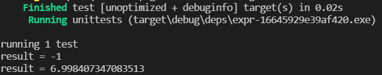

# Math-rs
## 简介
使用纯rust编写的表达式解析、运算库。支持常见数学运算、设置变量。
## Example
```rust
use mathrs::expr::Expression;

let mut expr = Expression::parse("1 + 2*3 - x1 * x2");
expr.set_variable("x1", "2")
    .set_variable("x2", "2 * 2");
let result = expr.excute();
println!("result = {}", result);
expr.set_variable("x1", "sin(3.14)")
    .set_variable("x2", "1");
let result = expr.excute();
println!("result = {}", result);
```



